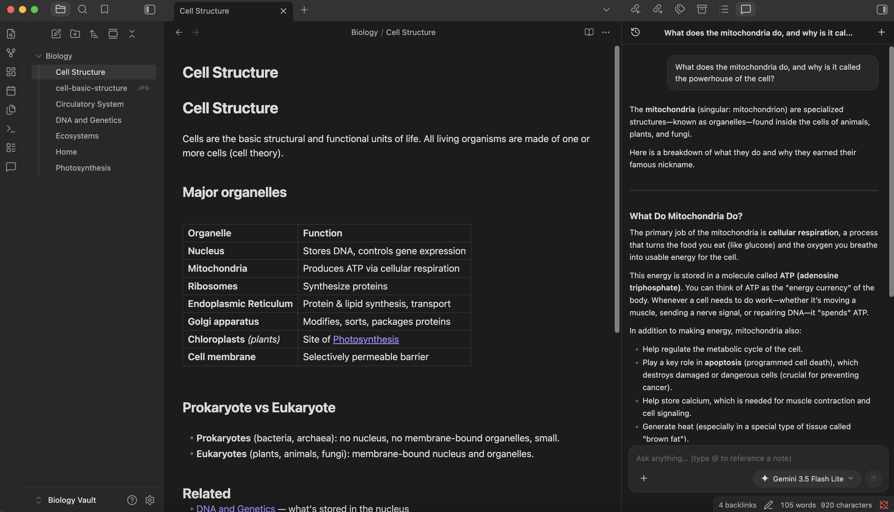
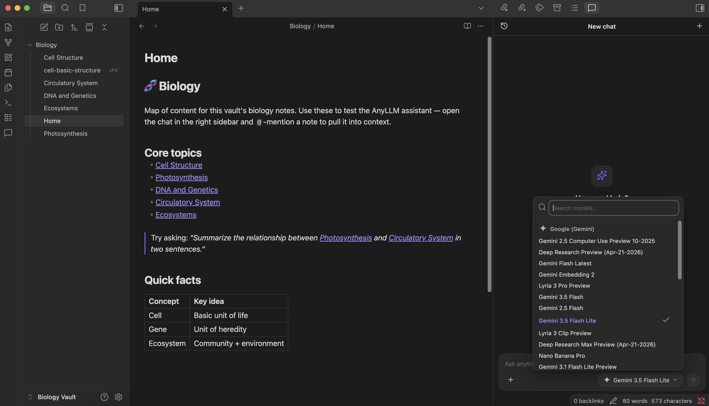
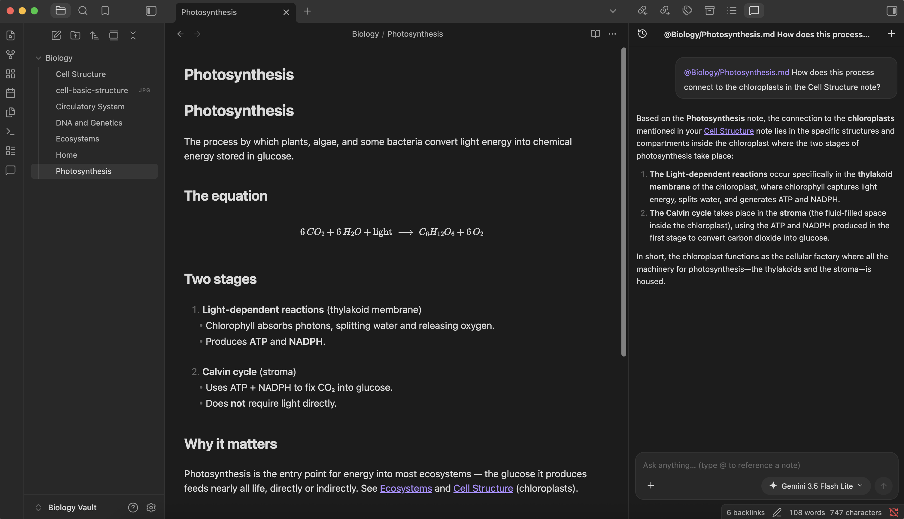
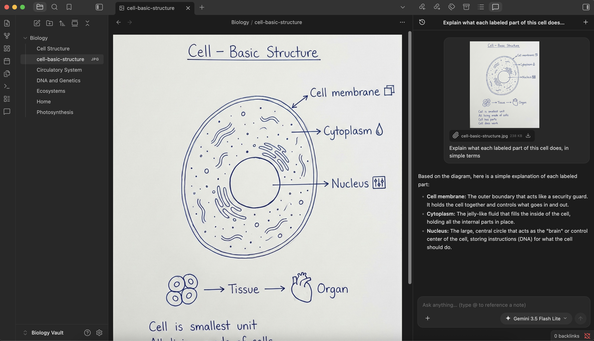

<picture>
  <source media="(prefers-color-scheme: dark)" srcset="images/logo-white.svg">
  
</picture>

# AnyLLM

**One AI chat for every model — right inside Obsidian.**

Chat with OpenAI, Anthropic, and Gemini — plus 10 more providers and custom OpenAI-compatible endpoints. Bring your own key, or sign in with your ChatGPT or Claude subscription.

*Desktop only — currently in beta.*

  

---

## Features

- **Every major LLM provider** — OpenAI, Anthropic (Claude), and Google (Gemini), plus 10 more providers and any local or OpenAI-compatible endpoint (Ollama, LM Studio, …).
- **Switch models mid-conversation** — keep one conversation and move between any provider's models as you go.
- **Bring your own key, or just sign in** — use an API key, or authenticate with your **ChatGPT Plus/Pro** or **Claude Pro/Max** subscription via OAuth. No key needed.
- **Reference your notes with `@`** — pull any vault note straight into the conversation as context.
- **Multimodal attachments** — images, PDFs, audio, video, and text files. The composer only enables attachment types the selected model supports.
- **Native Obsidian feel** — lives in the right sidebar, markdown rendered with Obsidian's own renderer, themed to match your vault.

## Install (beta)

AnyLLM is in beta and distributed via [BRAT](https://github.com/TfTHacker/obsidian42-brat):

1. Install and enable the **BRAT** community plugin.
2. BRAT settings → **Add Beta plugin** → enter `nethbotheju/obsidian-ai-plugin`.
3. BRAT installs AnyLLM from the latest GitHub release. Enable it, then run **AnyLLM: Open** (or click the ribbon icon).

_Ran into trouble or found a bug? [Open an issue](https://github.com/nethbotheju/obsidian-ai-plugin/issues)._

## In action

**Search and switch models** — pick from every model of every provider you've configured.

**Reference notes with `@`** — mention a note to pull it into context, then ask across them.

**Attach images & files** — drop in an image or PDF and the model reads it directly.

## Supported providers

Configured in **Settings → AnyLLM**. A curated catalog ships with the common providers preconfigured — pick one, add your key (or sign in), and you're ready.

**API key**
OpenAI, Anthropic (Claude), Google (Gemini), DeepSeek, Groq, Mistral, xAI (Grok), OpenRouter, Together AI, Fireworks AI, Cerebras, Perplexity, OpenCode Go

**Subscription sign-in (OAuth)**
ChatGPT Plus/Pro, Claude Pro/Max — no API key needed.

**Local / custom**
Ollama ships preconfigured. For anything else — LM Studio, your own server, or any OpenAI-compatible endpoint — choose **Custom (OpenAI-compatible)** from the provider dropdown, then set a Base URL and list your model ids.

_Need a provider that isn't listed? [Open an issue](https://github.com/nethbotheju/obsidian-ai-plugin/issues) and we'll look into adding it._

## Contributing

Pull requests are welcome.

1. Fork the repo and create a branch using `<type>/<issue>-<slug>` (e.g. `feat/24-conversation-search`, `fix/12-model-picker-scroll`).
2. Open a pull request against `main` describing the change.

Coding agents should follow [AGENTS.md](AGENTS.md) for project structure, conventions, and setup.

## License

This project is licensed under the [MIT License](LICENSE).

Copyright © 2026 nethbotheju.
